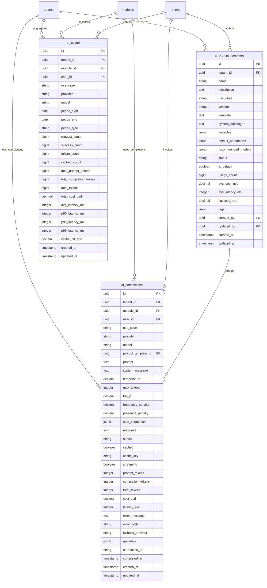

# Database ER Diagram — AI Service

This service logs LLM request completions details, pricing/token usages, configurations, and prompt templates.

```mermaid
erDiagram
    ai_completions {
        uuid id PK
        uuid tenant_id FK
        uuid module_id FK
        uuid user_id FK
        string use_case
        string provider
        string model
        uuid prompt_template_id FK
        text prompt
        text system_message
        decimal temperature
        integer max_tokens
        decimal top_p
        decimal frequency_penalty
        decimal presence_penalty
        jsonb stop_sequences
        text response
        string status
        boolean cached
        string cache_key
        boolean streaming
        integer prompt_tokens
        integer completion_tokens
        integer total_tokens
        decimal cost_usd
        integer latency_ms
        text error_message
        string error_code
        string fallback_provider
        jsonb metadata
        string correlation_id
        timestamp completed_at
        timestamp created_at
        timestamp updated_at
    }

    ai_prompt_templates {
        uuid id PK
        uuid tenant_id FK
        string name
        text description
        string use_case
        integer version
        text template
        text system_message
        jsonb variables
        jsonb default_parameters
        jsonb recommended_models
        string status
        boolean is_default
        bigint usage_count
        decimal avg_cost_usd
        integer avg_latency_ms
        decimal success_rate
        jsonb tags
        uuid created_by FK
        uuid updated_by FK
        timestamp created_at
        timestamp updated_at
    }

    ai_usage {
        uuid id PK
        uuid tenant_id FK
        uuid module_id FK
        uuid user_id FK
        string use_case
        string provider
        string model
        date period_start
        date period_end
        string period_type
        bigint request_count
        bigint success_count
        bigint failure_count
        bigint cached_count
        bigint total_prompt_tokens
        bigint total_completion_tokens
        bigint total_tokens
        decimal total_cost_usd
        integer avg_latency_ms
        integer p50_latency_ms
        integer p95_latency_ms
        integer p99_latency_ms
        decimal cache_hit_rate
        timestamp created_at
        timestamp updated_at
    }

    tenants ||--o{ ai_completions : "logs_completions"
    modules ||--o{ ai_completions : "uses_completions"
    users ||--o{ ai_completions : "invokes"
    ai_prompt_templates ||--o{ ai_completions : "formats"
    tenants ||--o{ ai_prompt_templates : "customizes"
    users ||--o{ ai_prompt_templates : "authors"
    tenants ||--o{ ai_usage : "aggregates"
    modules ||--o{ ai_usage : "monitors"
    users ||--o{ ai_usage : "triggers"
```
