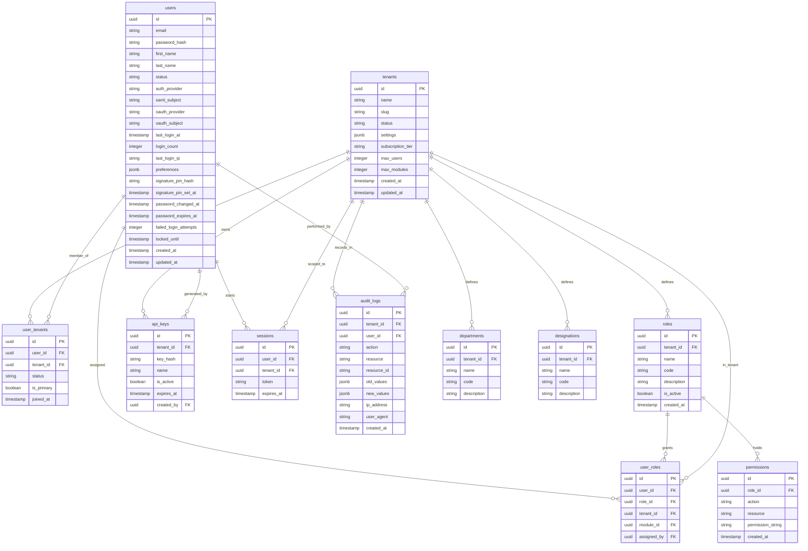

# Database ER Diagram — Core Identity & Tenant Service

This service manages tenant registration, user accounts, tenant members, roles, permissions, API keys, and sessions.

```mermaid
erDiagram
    tenants {
        uuid id PK
        string name
        string slug
        string status
        jsonb settings
        string subscription_tier
        integer max_users
        integer max_modules
        timestamp created_at
        timestamp updated_at
    }

    users {
        uuid id PK
        string email
        string password_hash
        string first_name
        string last_name
        string status
        string auth_provider
        string saml_subject
        string oauth_provider
        string oauth_subject
        timestamp last_login_at
        integer login_count
        string last_login_ip
        jsonb preferences
        string signature_pin_hash
        timestamp signature_pin_set_at
        timestamp password_changed_at
        timestamp password_expires_at
        integer failed_login_attempts
        timestamp locked_until
        timestamp created_at
        timestamp updated_at
    }

    user_tenants {
        uuid id PK
        uuid user_id FK
        uuid tenant_id FK
        string status
        boolean is_primary
        timestamp joined_at
    }

    roles {
        uuid id PK
        uuid tenant_id FK
        string name
        string code
        string description
        boolean is_active
        timestamp created_at
    }

    permissions {
        uuid id PK
        uuid role_id FK
        string action
        string resource
        string permission_string
        timestamp created_at
    }

    user_roles {
        uuid id PK
        uuid user_id FK
        uuid role_id FK
        uuid tenant_id FK
        uuid module_id FK
        uuid assigned_by FK
    }

    api_keys {
        uuid id PK
        uuid tenant_id FK
        string key_hash
        string name
        boolean is_active
        timestamp expires_at
        uuid created_by FK
    }

    sessions {
        uuid id PK
        uuid user_id FK
        uuid tenant_id FK
        string token
        timestamp expires_at
    }

    audit_logs {
        uuid id PK
        uuid tenant_id FK
        uuid user_id FK
        string action
        string resource
        string resource_id
        jsonb old_values
        jsonb new_values
        string ip_address
        string user_agent
        timestamp created_at
    }

    departments {
        uuid id PK
        uuid tenant_id FK
        string name
        string code
        string description
    }

    designations {
        uuid id PK
        uuid tenant_id FK
        string name
        string code
        string description
    }

    tenants ||--o{ user_tenants : "has"
    users ||--o{ user_tenants : "member_of"
    tenants ||--o{ roles : "defines"
    roles ||--o{ permissions : "holds"
    users ||--o{ user_roles : "assigned"
    roles ||--o{ user_roles : "grants"
    tenants ||--o{ user_roles : "in_tenant"
    tenants ||--o{ api_keys : "owns"
    users ||--o{ api_keys : "generated_by"
    users ||--o{ sessions : "starts"
    tenants ||--o{ sessions : "scoped_to"
    tenants ||--o{ audit_logs : "records_in"
    users ||--o{ audit_logs : "performed_by"
    tenants ||--o{ departments : "defines"
    tenants ||--o{ designations : "defines"
```
