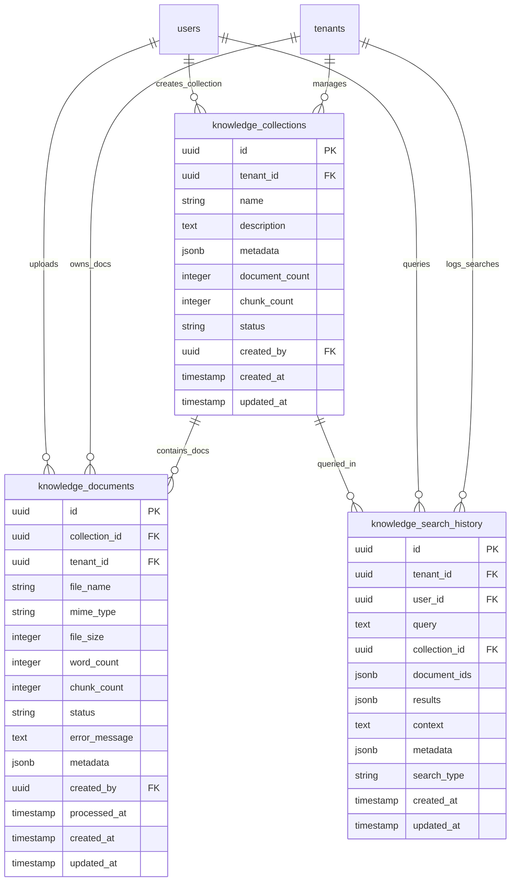

# Database ER Diagram — Knowledge Service

This service tracks knowledge base collection nodes, documents parsed, vector chunk counts, metadata configurations, and query logs.

```mermaid
erDiagram
    knowledge_collections {
        uuid id PK
        uuid tenant_id FK
        string name
        text description
        jsonb metadata
        integer document_count
        integer chunk_count
        string status
        uuid created_by FK
        timestamp created_at
        timestamp updated_at
    }

    knowledge_documents {
        uuid id PK
        uuid collection_id FK
        uuid tenant_id FK
        string file_name
        string mime_type
        integer file_size
        integer word_count
        integer chunk_count
        string status
        text error_message
        jsonb metadata
        uuid created_by FK
        timestamp processed_at
        timestamp created_at
        timestamp updated_at
    }

    knowledge_search_history {
        uuid id PK
        uuid tenant_id FK
        uuid user_id FK
        text query
        uuid collection_id FK
        jsonb document_ids
        jsonb results
        text context
        jsonb metadata
        string search_type
        timestamp created_at
        timestamp updated_at
    }

    tenants ||--o{ knowledge_collections : "manages"
    users ||--o{ knowledge_collections : "creates_collection"
    knowledge_collections ||--o{ knowledge_documents : "contains_docs"
    tenants ||--o{ knowledge_documents : "owns_docs"
    users ||--o{ knowledge_documents : "uploads"
    tenants ||--o{ knowledge_search_history : "logs_searches"
    users ||--o{ knowledge_search_history : "queries"
    knowledge_collections ||--o{ knowledge_search_history : "queried_in"
```
