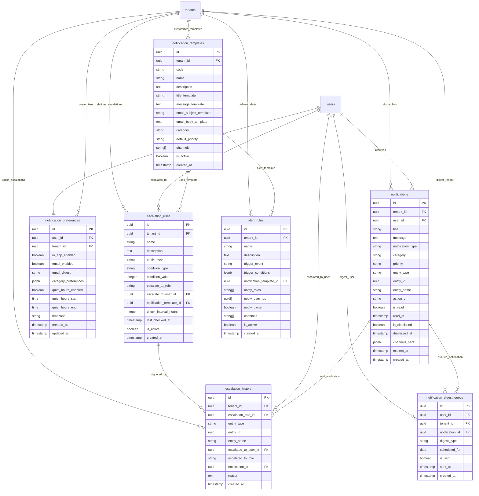

# Database ER Diagram — Notification Service

This service processes alerts, in-app notifications history, user configuration preferences, dynamic templates, alert rules, and escalations.

```mermaid
erDiagram
    notifications {
        uuid id PK
        uuid tenant_id FK
        uuid user_id FK
        string title
        text message
        string notification_type
        string category
        string priority
        string entity_type
        uuid entity_id
        string entity_name
        string action_url
        boolean is_read
        timestamp read_at
        boolean is_dismissed
        timestamp dismissed_at
        jsonb channels_sent
        timestamp expires_at
        timestamp created_at
    }

    notification_preferences {
        uuid id PK
        uuid user_id FK
        uuid tenant_id FK
        boolean in_app_enabled
        boolean email_enabled
        string email_digest
        jsonb category_preferences
        boolean quiet_hours_enabled
        time quiet_hours_start
        time quiet_hours_end
        string timezone
        timestamp created_at
        timestamp updated_at
    }

    notification_templates {
        uuid id PK
        uuid tenant_id FK
        string code
        string name
        text description
        string title_template
        text message_template
        string email_subject_template
        text email_body_template
        string category
        string default_priority
        string[] channels
        boolean is_active
        timestamp created_at
    }

    escalation_rules {
        uuid id PK
        uuid tenant_id FK
        string name
        text description
        string entity_type
        string condition_type
        integer condition_value
        string escalate_to_role
        uuid escalate_to_user_id FK
        uuid notification_template_id FK
        integer check_interval_hours
        timestamp last_checked_at
        boolean is_active
        timestamp created_at
    }

    escalation_history {
        uuid id PK
        uuid tenant_id FK
        uuid escalation_rule_id FK
        string entity_type
        uuid entity_id
        string entity_name
        uuid escalated_to_user_id FK
        string escalated_to_role
        uuid notification_id FK
        text reason
        timestamp created_at
    }

    notification_digest_queue {
        uuid id PK
        uuid user_id FK
        uuid tenant_id FK
        uuid notification_id FK
        string digest_type
        date scheduled_for
        boolean is_sent
        timestamp sent_at
        timestamp created_at
    }

    alert_rules {
        uuid id PK
        uuid tenant_id FK
        string name
        text description
        string trigger_event
        jsonb trigger_conditions
        uuid notification_template_id FK
        string[] notify_roles
        uuid[] notify_user_ids
        boolean notify_owner
        string[] channels
        boolean is_active
        timestamp created_at
    }

    tenants ||--o{ notifications : "dispatches"
    users ||--o{ notifications : "receives"
    users ||--|| notification_preferences : "configures"
    tenants ||--o{ notification_preferences : "customizes"
    tenants ||--o{ notification_templates : "customizes_templates"
    tenants ||--o{ escalation_rules : "defines_escalations"
    users ||--o{ escalation_rules : "escalates_to"
    notification_templates ||--o{ escalation_rules : "uses_template"
    tenants ||--o{ escalation_history : "tracks_escalations"
    escalation_rules ||--o{ escalation_history : "triggered_by"
    users ||--o{ escalation_history : "escalated_to_user"
    notifications ||--o{ escalation_history : "sent_notification"
    users ||--o{ notification_digest_queue : "digest_user"
    tenants ||--o{ notification_digest_queue : "digest_tenant"
    notifications ||--o{ notification_digest_queue : "queued_notification"
    tenants ||--o{ alert_rules : "defines_alerts"
    notification_templates ||--o{ alert_rules : "alert_template"
```
