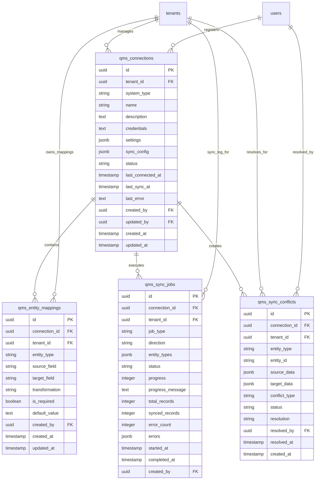

# Database ER Diagram — QMS Integration Service

This service stores quality connections settings, dynamic translation field mappings, sync history, and active conflict ledger entries.

```mermaid
erDiagram
    qms_connections {
        uuid id PK
        uuid tenant_id FK
        string system_type
        string name
        text description
        text credentials
        jsonb settings
        jsonb sync_config
        string status
        timestamp last_connected_at
        timestamp last_sync_at
        text last_error
        uuid created_by FK
        uuid updated_by FK
        timestamp created_at
        timestamp updated_at
    }

    qms_entity_mappings {
        uuid id PK
        uuid connection_id FK
        uuid tenant_id FK
        string entity_type
        string source_field
        string target_field
        string transformation
        boolean is_required
        text default_value
        uuid created_by FK
        timestamp created_at
        timestamp updated_at
    }

    qms_sync_jobs {
        uuid id PK
        uuid connection_id FK
        uuid tenant_id FK
        string job_type
        string direction
        jsonb entity_types
        string status
        integer progress
        text progress_message
        integer total_records
        integer synced_records
        integer error_count
        jsonb errors
        timestamp started_at
        timestamp completed_at
        uuid created_by FK
    }

    qms_sync_conflicts {
        uuid id PK
        uuid connection_id FK
        uuid tenant_id FK
        string entity_type
        string entity_id
        jsonb source_data
        jsonb target_data
        string conflict_type
        string status
        string resolution
        uuid resolved_by FK
        timestamp resolved_at
        timestamp created_at
    }

    tenants ||--o{ qms_connections : "manages"
    users ||--o{ qms_connections : "registers"
    qms_connections ||--o{ qms_entity_mappings : "contains"
    tenants ||--o{ qms_entity_mappings : "owns_mappings"
    qms_connections ||--o{ qms_sync_jobs : "executes"
    tenants ||--o{ qms_sync_jobs : "sync_log_for"
    qms_connections ||--o{ qms_sync_conflicts : "creates"
    tenants ||--o{ qms_sync_conflicts : "resolves_for"
    users ||--o{ qms_sync_conflicts : "resolved_by"
```
